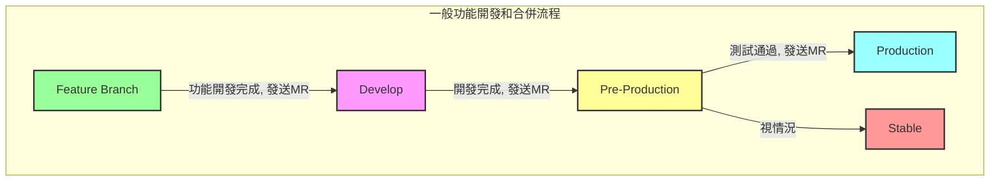
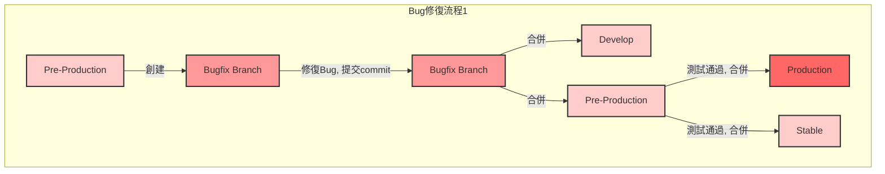
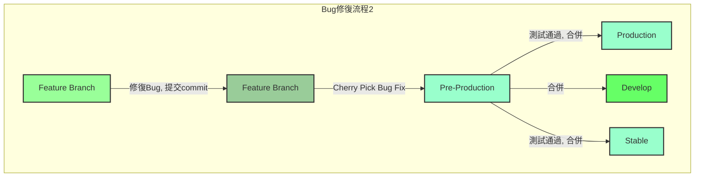

# Git 開發流程手冊

## git 分支建立與 merge 流程說明

 | 分支類型 | 用途 | 說明 | merge 說明 |
 |  ----  | ----  | ----  | ----  | 
 | production | 正式機 | 隨時可上線的版本 | 不會有 merge 到其他分支的情況 |
 | pre-production | 測試機 | 客戶端的測試機版本 | 由專案主要負責人發 MR，請小組長或專案主要負責人，再次確認異動並測試後，再 merge 到 production，並視情況是否要 merge 到 stable。 |
 | stable | 特殊客戶正式機 | 當有特殊版本需求時，針對一個特殊版本建立一條 stable 分支。命名方式為 "stable-<可辨識特殊版本的命名>"。 |  不會有 merge 到其他分支的情況 |
 | develop | 開發基底 | 所有的分支都是由此分支建立 | 開發到一個段落需要更新到測試機上時，由專案主要負責人發 MR，請小組長或專案主要負責人再次確認過異動內容後，再 merge 到 pre-production。特殊客戶正式機 bug 修復的部分，則是用 cherry pick 的方式去更新到 stable 分支。|
 | feature | 開發功能 | 一個獨立的修改需求或 bug 修復，皆直接新增一個新的分支。命名方式為 "feature/<jira單號>" 或 "feature/<功能簡述>" |參考下方的 feture merge 流程與注意事項 |

## feture merge 流程與注意事項

| merge 流程 | 說明 | 目的 |
|  ----  | ----  | ----  |
| 修改 commit 歷史 | 當此分支沒有其他共同開發者在使用時，如果有針對同一個錯誤多次進行修復時，可以考慮修改 commit 歷史。 | 將多次的修復整合為一個節點，可使 commit 的節點乾淨且明確。|	
| rebase 至最新版 | rebase 到目前 gitlab 上最新版的程式碼，並解決所有發生的衝突。 | 經過 rebase 後的分支，在 MR 通過後會在 flow 上形成盡可能最小化的小耳朵。將簡化並改善 flow 的可讀性。|
| MR 發送前確認 | 確定異動內容、確保程式碼品質、確定可以編譯、且已在本機測試完成後。再發送整合到 develop 的 MR 給專案主要負責人。|		

## 一般的功能開發和合併流程

### 流程圖

### 說明

1. **Feature Branch**：開發新功能。
2. **Develop**：功能開發完成後，發送MR合併到Develop。
3. **Pre-Production**：開發完成，發送MR合併到Pre-Production進行測試。
4. **Production**：測試通過後，發送MR合併到Production。
5. **Stable**：視情況從Pre-Production發送MR合併到Stable。

## 從Pre-Production創建Bug修復分支的流程

### 流程圖

### 說明

1. **Pre-Production**：從Pre-Production創建Bugfix Branch。
2. **Bugfix Branch**：修復Bug並提交commit。
3. **Develop**：將Bugfix Branch合併回Develop。
4. **Pre-Production**：將Bugfix Branch合併回Pre-Production。
5. **Production**：測試通過後，從Pre-Production合併到Production。
6. **Stable**：測試通過後，從Pre-Production合併到Stable。

## 在Feature Branch上修復並Cherry Pick的流程

### 流程圖

### 說明

1. **Feature Branch**：在Feature Branch上修復Bug並提交commit。
2. **Pre-Production**：使用Cherry Pick將Bug修復應用到Pre-Production。
3. **Production**：測試通過後，將Pre-Production合併到Production。
4. **Develop**：將Pre-Production合併回Develop。
5. **Stable**：測試通過後，將Pre-Production合併到Stable。
